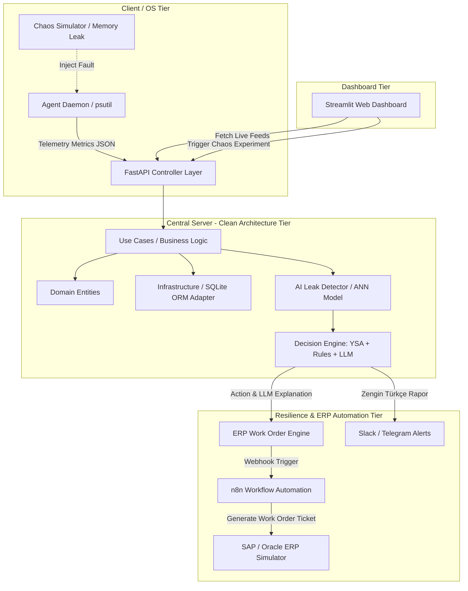

# FinTech YSA Destekli Bellek Sızıntısı Tahmin ve Dayanıklılık Platformu
> **AI-Driven Chaos Engineering, Memory Leak Forecasting & Automatic ERP Resilience Engine**


---

## 📌 Proje Hakkında (About The Project)

Bu platform; yüksek erişilebilirlik gerektiren **FinTech ve Bankacılık sunucularını** saniye saniye izleyen, kasıtlı olarak enjekte edilen bellek sızıntılarını (Memory Leak) **Yapay Sinir Ağları (YSA)** ile saatler öncesinden tespit eden ve **Clean Architecture** prensipleriyle tasarlanmış merkezi sunucusu üzerinden **Otomatik ERP İş Emirleri (Work Order)** üreterek sistem çökmesini engelleyen yapay zeka destekli bir önleyici bakım (Proactive Mitigation) platformudur. 

### 🌟 Temel Yetenekler (Core Capabilities)

- **Genişletilmiş Telemetri Analizi**: `psutil` üzerinden toplanan CPU, RAM, Disk Kullanımı ve Ağ G/Ç verileri, çok boyutlu yapay sinir ağı (YSA) girdi vektörlerini besleyerek anomalileri daha geniş bir bağlamda değerlendirir.
- **XAI (Explainable AI) & Ablation Study**: Platform yalnızca skorsal tahminler üretmekle kalmaz; arka planda koşan *Ablation Study* motoru ile anomaliye sebep olan kaynağı nedenselliğiyle açıklar (Örn: "Tahmine %47 oranında CPU darbogazı etki etmiştir").
- **LLM Destekli Otonom Karar Motoru (Structured Output)**: YSA'nın ürettiği XAI verileri ve risk metrikleri, Pydantic şemasıyla çalışan **Qwen 2.5 / Ollama** destekli bir LLM Karar Motoru tarafından yorumlanır. Çıktılar yapılandırılmış (Structured JSON) formattadır, böylece sıfır halüsinasyonla eyleme dönüştürülebilir.
- **Dinamik Streamlit Dashboard**: Karar motorunun analizleri (LLM Güven Skoru, Feature Etki Düzeyleri vb.) gerçek zamanlı Dashboard arayüzünde canlı grafikler ve ilerleme çubuklarıyla (progress bars) profesyonelce görselleştirilir.
- **Self-Healing & ERP Entegrasyonu**: Yüksek riskli anomali durumlarında Telegram üzerinden formatlı raporlar gönderilir ve ilgili ERP sisteminde (Örn: SAP/Oracle) otomatik iş emri açılarak otonom self-healing aksiyonları başlatılır.

---

## 📽️ Canlı Gösterim & Demo (Demo GIF)

<!--  -->
*(Demo yakında eklenecek)*

*(Canlı Dashboard: RAM Metrik Akışı, YSA Tahmin Eğrisi, Otomatik ERP Bilet Üretimi, XAI Etki Analizleri ve Kaos Kontrol Paneli)*

---

## 🏛️ Sistem Mimarisi (Architecture Diagram)

Projemiz Uncle Bob'un **Clean Architecture** prensiplerine göre tamamen modüler katmanlara ayrılmıştır:



---

## 📂 Klasör Yapısı (Project Layout)

```text
ai-chaos-platform/
├── server/                 # Clean Architecture Merkezi Backend
│   ├── domain/             # Saf Python İş Varlıkları (Metric, WorkOrder)
│   ├── usecases/           # İş Kuralları (Ingest, Predict, Decision Engine, ERP Logic)
│   ├── infrastructure/     # Veritabanı ve Kurumsal Adaptörler (LLM Adapter)
│   └── api/                # FastAPI REST API Controller Rotaları
├── agent/                  # Sistem İzleme Ajanı & Kaos Modülleri
│   ├── monitor.py          # psutil Metrik Toplayıcı
│   ├── chaos.py            # Bellek Sızıntısı & Stress Simülatörü
│   └── network.py          # HTTP Telemetry Gönderici
├── ai/                     # Yapay Zeka Modülü
│   ├── neural_network.py   # PyTorch / MLPRegressor YSA Modeli
│   └── leak_detector.py    # Time-to-OOM ve Eğitilmiş Model Servisi
├── dashboard/              # Streamlit Canlı İzleme Paneli
│   └── app.py              # Streamlit Web UI
```

---

## 🚀 Hızlı Başlangıç (Quickstart)

### ⚡ Sistem Gereksinimleri
- Python 3.10+
- **Ollama** kurulu ve Qwen 2.5 modeli indirilmiş olmalı (`ollama pull qwen2.5`)

### 1. Yerel Ortamda Çalıştırma (Local Setup)

```bash
# 1. Depoyu klonlayın
git clone https://github.com/kullaniciadi/ai-chaos-platform.git
cd ai-chaos-platform

# 2. Bağımlılıkları kurun
pip install -r requirements.txt

# 3. FastAPI Sunucusunu Başlatın
uvicorn server.api.main:app --reload

# 4. Streamlit Dashboard'u Başlatın
streamlit run dashboard/app.py

# 5. Veri Toplayıcı Ajanı Çalıştırın (Farklı bir terminalde)
python agent/monitor.py
```


## 🔗 API Uç Noktaları (REST API Endpoints)

| Metot | Uç Nokta | Açıklama |
| :--- | :--- | :--- |
| `POST` | `/api/v1/metrics` | Ajanlardan gelen metrikleri asenkron olarak kaydeder |
| `GET` | `/api/v1/metrics/latest` | Canlı metrikleri Streamlit arayüzüne sunar |
| `GET` | `/api/v1/predictions` | YSA modelinin tahmini çökme süresini (Time-to-OOM) döner |
| `POST` | `/api/v1/evaluate` | YSA + Kural Motoru + LLM (Decision Engine) üzerinden karar açıklar |
| `GET` | `/api/v1/evaluate/latest` | En son alınan LLM kararını yapılandırılmış JSON olarak sunar |
| `GET` | `/api/v1/work-orders` | Otomatik üretilen ERP İş Emirlerini listeler |
| `POST` | `/api/v1/chaos/start-leak` | Arayüzden Bellek Sızıntısı (Memory Leak) testi başlatır |
| `POST` | `/api/v1/chaos/start-cpu` | Arayüzden CPU Stress testi başlatır |
| `POST` | `/api/v1/chaos/stop` | Devam eden Kaos testlerini durdurur |

---

## 📜 Lisans (License)
MIT License © 2026 Naz

---

## 🖼️ Grafikleri Üretmek İçin (Generate Charts Locally)

Bu repoda `.png` grafik dosyaları bulunmaz (`.gitignore` ile hariç tutulmuştur).
Aşağıdaki komutlarla grafikler **yerel makinenizde** üretilir:

```bash
# YSA Permutation Importance grafiği (ai/permutation_importance.png)
python ai/explainability.py

# RAM Tahmin vs Gerçek grafiği (test_ram_vs_prediction.png)
python -m pytest test_integration_week3.py -v
```

> Dashboard'daki **Ablation Study** görseli bu komutlar çalıştırıldıktan sonra görünür hale gelir.
